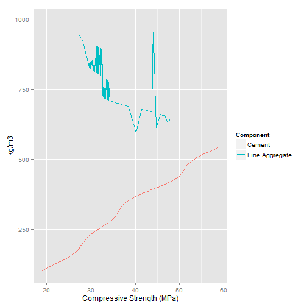

Compressive Strength prediction with Shiny!
========================================================
author: Maury Miller
date: 2/18/2015
width: 1000
height: 1200
font-family: 'Helvetica'

Introduction
========================================================

The shiny app displays a prediction of compressive strength for
an amount of cement or an amount of fine aggregate.  It uses a svm
model for prediction.  
The app allows a user to enter a value for cement
and fine aggregate concentration in a side panel. The app will predict the
compressive strength and reactively display it in the main panel.

The data are from Yeh (1998) and taken from 
the University of California, Irvine Machine Learning Repository
website http://archive.ics.uci.edu/ml/datasets/Concrete+Compressive+Strength.
It has the predictor columns Cement, BlastFurnaceSlag, FlyAsh, Water, Superplasticizer, 
CoarseAggregate, FineAggregate and Age with response column CompressiveStrength.

I used a training set to train the model.  The prediction comes from a testing data set.


Concrete Data
========================================================


```
  Cement BlastFurnaceSlag FlyAsh Water Superplasticizer CoarseAggregate
1  540.0              0.0      0   162              2.5          1040.0
2  540.0              0.0      0   162              2.5          1055.0
3  332.5            142.5      0   228              0.0           932.0
4  332.5            142.5      0   228              0.0           932.0
5  198.6            132.4      0   192              0.0           978.4
6  266.0            114.0      0   228              0.0           932.0
  FineAggregate Age CompressiveStrength
1         676.0  28               79.99
2         676.0  28               61.89
3         594.0 270               40.27
4         594.0 365               41.05
5         825.5 360               44.30
6         670.0  90               47.03
```

Prediction models
========================================================


```

Call:
svm(formula = CompressiveStrength ~ Cement, data = training)


Parameters:
   SVM-Type:  eps-regression 
 SVM-Kernel:  radial 
       cost:  1 
      gamma:  1 
    epsilon:  0.1 


Number of Support Vectors:  708
```

```

Call:
svm(formula = CompressiveStrength ~ FineAggregate, data = training)


Parameters:
   SVM-Type:  eps-regression 
 SVM-Kernel:  radial 
       cost:  1 
      gamma:  1 
    epsilon:  0.1 


Number of Support Vectors:  692
```

Concrete compressive strength using prediction
========================================================


